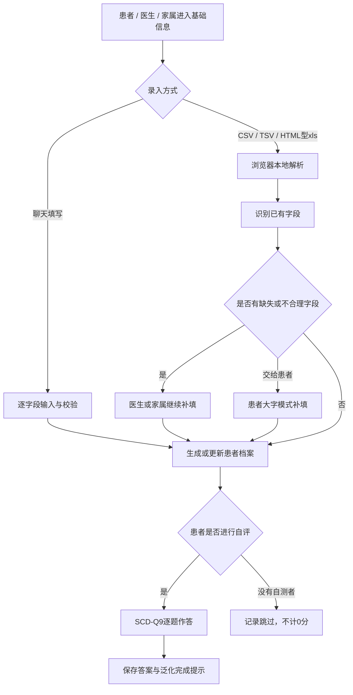

# 患者填表与基础信息咨询前端 · 个人负责模块说明

> 本文只描述本人在小组作业中负责和交付的内容。项目整体背景、全部量表及其他成员工作仍以 `README.md` 和需求文档为准。

## 1. 一句话责任范围

本人负责**患者基础信息采集、患者本人自评，以及与这两条流程直接相关的前端交互和后端接口约定**。

医生和家属可以代患者录入或导入基础信息，但这些入口仍属于“患者基础信息采集”模块；本人不负责医生临床诊断业务或家属专业观察量表。

## 2. 负责范围（In Scope）

### 2.1 患者基础信息采集

- 以聊天问答方式采集姓名、性别、出生年份、教育年限、身高、体重、婚姻、居住和手机号。
- 患者本人、医生或家属可以进入同一套基础信息流程。
- 出生年份自动换算年龄，完成后自动生成研究编号。
- 对姓名、出生年份、教育年限、身高、体重和手机号进行格式及合理性校验，不合理时要求重新输入。
- 手机号为可选字段，可以选择“暂不填写”。

### 2.2 表格导入与缺失信息补填

- 医生和家属可以导入 CSV、TSV 或本系统导出的 HTML 型 `.xls`。
- 自动识别常见中英文表头，并提取可用的患者基础字段。
- 优先按研究编号或姓名匹配当前患者。
- 缺失、无法识别或校验失败的字段回到聊天流程逐项补填。
- 支持“由患者本人补填”：保留已识别字段，将设备交给患者完成剩余项目，不重复创建患者。
- 文件仅在浏览器本地读取，当前不会上传患者文件。

### 2.3 患者本人自评

- 患者完成基础信息后可以进入 SCD-Q9 主观认知下降自评。
- 问题使用大字号、高对比当前题样式和大点击区域。
- 当前题与历史消息分层显示，关键信息和状态字段高亮。
- 提供语音朗读、进度条、自动保存和断点续填。
- 没有自测者时允许跳过；跳过状态不计为 0 分，之后仍可由患者补做。
- 患者侧只显示泛化完成提示，不给出临床诊断结论。

### 2.4 支撑上述流程的公共前端能力

- 三通道入口及角色切换状态保护。
- 未完成流程离开确认、按角色保存草稿、返回后继续填写。
- `.bigbtn`、`.primary`、`.secondary`、`.guide` 等可复用按钮样式。
- 主按钮低频呼吸提示，并支持 `prefers-reduced-motion` 关闭动画。
- 适老化字号、焦点态、移动端布局、在线 / 离线状态和自动保存提示。
- 对动态展示和导出文本进行 HTML 转义。

## 3. 明确不负责的内容（Out of Scope）

以下能力可能仍出现在共享原型中，但不属于本人业务交付范围：

- 医生专业评定量表：HAMD、HAMA、MMSE、MoCA-B、AVLT-H、VFT。
- 家属 / 知情者专业量表：FAQ、NPI、CDR。
- 医生最终诊断、临床决策、报告医学结论和量表常模制定。
- 后端服务实现、数据库、登录鉴权、权限管理、云端同步和部署运维。
- 病历图片 OCR、二进制 `.xlsx` 解析、多患者批量导入确认页面。
- 生产环境的数据加密、审计、备份和合规审批。
- 通用智能问诊或大模型诊断。

共享原型中的医生报告、Excel 导出和其他量表入口仅用于整体演示或兼容联调。本人对其中与患者基础信息流转有关的按钮和状态做过检查，但这不等于承担这些业务模块。

## 4. “基础信息咨询”的边界

本模块中的“咨询”指患者在填表过程中获得字段解释、输入提示、错误反馈和固定的基础说明，不是医疗问诊。

| 能力 | 状态 | 边界 |
|---|---|---|
| 填表引导和输入提示 | 已完成 | 前端本地固定文案 |
| 不合理信息检测和重试 | 已完成 | 只做格式、范围校验 |
| 固定 FAQ 接口契约 | 已设计，未接入 | 见 `API接口设计.md` 第 7 节 |
| 在线智能客服 / 大模型问答 | 未实现 | 不在本次交付范围 |
| 疾病诊断和治疗建议 | 禁止提供 | 必须转交医生 |

因此，验收时不应把“可以在线自由问诊”作为本人模块的完成标准。

## 5. 文件与代码边界

| 文件 | 本人负责部分 | 共享 / 他人部分 |
|---|---|---|
| `ad-ouc-prototype/index.html` | 基础信息流程所需容器、角色和文件选择入口 | 整体页面骨架 |
| `ad-ouc-prototype/styles.css` | 适老化表单、聊天气泡、按钮、当前题、错误提示、移动端样式 | 报告和其他量表共用样式 |
| `ad-ouc-prototype/app.js` | 建档、导入、校验、补填、自评跳过、草稿、角色状态和相关 UI 渲染 | 医生报告、全部患者导出及其他量表通用计分逻辑 |
| `ad-ouc-prototype/scales.js` | `window.INTAKE` 和 `SCD-Q9` 配置 | HAMD、HAMA、MMSE、MoCA-B、AVLT、VFT、FAQ、NPI、CDR |
| `API接口设计.md` | 患者档案、导入、缺失字段、草稿、SCD-Q9 提交 / 完成 / 跳过、固定 FAQ 契约 | 报告、全量表和导出接口属于团队共享契约 |
| `README2.md` | 本人责任边界、使用和验收说明 | 无 |
| `工程日志.md` | 本人相关更新、错误和验证记录 | 团队可继续追加其他模块记录 |

`app.js` 和 `styles.css` 是共享文件。其他成员可以复用其中的引擎和 UI 类，但修改共享状态字段时需同时验证三个角色通道，避免破坏本人模块。

## 6. 技术框架与依赖

### 6.1 当前框架

| 技术 | 用途 | 引入方式 |
|---|---|---|
| HTML5 | 页面结构、语义化表单容器 | 项目原生文件 |
| CSS3 | 适老化布局、按钮体系、动画、响应式样式 | 项目原生文件 |
| 原生 JavaScript（ES5 风格） | 对话引擎、状态管理、校验、导入和导出 | 项目原生文件 |

当前没有引入 Vue、React、uni-app 运行时、UI 组件库、CDN 或 npm 依赖，不需要构建即可运行。

### 6.2 当前实际使用的浏览器 API

| API | 文档链接 | 用途 | 是否联网 |
|---|---|---|---|
| `localStorage` | [MDN Web Storage](https://developer.mozilla.org/zh-CN/docs/Web/API/Window/localStorage) | 保存患者资料、答案、角色草稿和流程状态 | 否 |
| `SpeechSynthesis` | [MDN SpeechSynthesis](https://developer.mozilla.org/zh-CN/docs/Web/API/SpeechSynthesis) | 朗读当前问题 | 否 |
| `FileReader` | [MDN FileReader](https://developer.mozilla.org/zh-CN/docs/Web/API/FileReader) | 本地读取 CSV、TSV 和 HTML 型 `.xls` | 否 |
| `DOMParser` | [MDN DOMParser](https://developer.mozilla.org/zh-CN/docs/Web/API/DOMParser) | 解析 HTML 型 `.xls` 表格 | 否 |
| `navigator.onLine` | [MDN Navigator.onLine](https://developer.mozilla.org/zh-CN/docs/Web/API/Navigator/onLine) | 显示在线 / 离线状态 | 否 |
| `Blob` / `URL.createObjectURL` | [MDN Blob](https://developer.mozilla.org/zh-CN/docs/Web/API/Blob) | 共享原型生成本地 `.xls` 下载 | 否 |

### 6.3 外部能力清单（本版本未调用）

| 外部能力 | 参考链接 | 预期用途 | 当前状态 |
|---|---|---|---|
| 项目后端 REST API | [`API接口设计.md`](API接口设计.md) | 持久化患者、草稿和自评数据 | 只完成契约，未接入 |
| SheetJS | [官方文档](https://docs.sheetjs.com/) | 后续支持二进制 `.xlsx` 解析 / 导出 | 未引入 |
| 腾讯云 OCR | [官方文档](https://cloud.tencent.com/document/product/866) | 后续从病历图片识别基础字段 | 未引入，不在本人交付范围 |
| DeepSeek API | [API 文档](https://api-docs.deepseek.com/) | 后续扩展固定基础咨询，不能直接诊断 | 未引入，不在本人当前交付范围 |

当前页面不会向上述第三方服务发送患者姓名、电话、病历或量表答案。

## 7. 本人模块流程



## 8. 核心按钮与状态边界

| 按钮 / 入口 | 前置状态 | 目标状态 | 异常处理 |
|---|---|---|---|
| 受试者「开始填写基础信息」 | 无患者档案 | `chat(intake)` | 输入不合理时停留当前题 |
| 医生 / 家属「录入患者基础信息」 | 对应角色首页 | `chat(intake)` | 角色必须显式传入，不能使用点击事件对象 |
| 「上传表格自动填充」 | 医生或家属首页 | 本地解析后进入补填或完成态 | 格式 / 编码错误时提供重新选择 |
| 「由患者本人补填」 | 表格仍有缺失字段 | 切换 `self` 大字模式并保留导入数据 | 不创建重复患者 |
| 「开始本人自评」 | 已有患者档案 | `chat(scale: SCD-Q9)` | 没有档案时先进入基础信息 |
| 「跳过本人自评」 | 受试者首页或自评菜单 | `scaleSkipped` | 不生成答案和 0 分结果 |
| 「继续上次」 | 当前角色存在未完成草稿 | 恢复对应 `chat` | 按角色及患者编号隔离 |
| 顶部「返回首页」 | 任意页面 | 当前角色首页 | 进行中流程先保存草稿 |
| 角色下拉切换 | 进行中流程 | 确认后进入新角色首页 | 取消则留在原流程，不能串用旧页面 |

医生报告、医生导出和非 SCD-Q9 量表按钮不属于本人业务范围，只做过共享状态兼容检查。

## 9. 与后端对接的接口边界

当前原型使用 `localStorage`，下列接口是后端接入约定，不代表已经联网：

| 方法 | 路径 | 本人前端调用目的 |
|---|---|---|
| `POST` | `/api/v1/patients` | 创建患者基础档案 |
| `GET` | `/api/v1/patients/{patientId}` | 恢复患者档案 |
| `PATCH` | `/api/v1/patients/{patientId}` | 修改或补充基础信息 |
| `GET` | `/api/v1/patients?researchNo=&name=` | 按编号或姓名匹配患者 |
| `POST` | `/api/v1/patients/import/preview` | 预览表格解析结果 |
| `POST` | `/api/v1/patients/import/{importId}/confirm` | 确认导入记录 |
| `PATCH` | `/api/v1/patients/{patientId}/missing-fields` | 提交缺失字段 |
| `PUT` | `/api/v1/patients/{patientId}/drafts/{role}` | 保存当前填写草稿 |
| `GET` | `/api/v1/patients/{patientId}/drafts/{role}` | 恢复对应角色草稿 |
| `POST` | `/api/v1/patients/{patientId}/assessments` | 创建 SCD-Q9 自评会话 |
| `PATCH` | `/api/v1/assessments/{assessmentId}/answers` | 增量提交自评答案 |
| `POST` | `/api/v1/assessments/{assessmentId}/complete` | 完成自评并获取后端结果 |
| `POST` | `/api/v1/assessments/{assessmentId}/skip` | 记录没有自测者时跳过 |
| `GET` | `/api/v1/faq/categories` | 获取固定基础咨询问题（预留） |
| `POST` | `/api/v1/faq/answer` | 获取固定基础说明（预留） |

完整请求体、返回体、错误码和安全要求见 [`API接口设计.md`](API接口设计.md)。

## 10. 可复用调用约定

其他前端成员复用本模块时，应遵守以下约定：

当前 `startIntake()`、`startScale()`、`bigBtn()` 和 `state` 都封装在 `app.js` 的 IIFE 内，只能在该文件内部直接调用，不是挂载到 `window` 的公共 SDK。其他独立页面如需调用，应先由团队把这些能力提取为公共模块；直接复用 CSS 类不受此限制。

- 基础信息题目配置统一读取 `window.INTAKE.items`，不要再复制一份字段列表。
- 患者自评统一通过 `startScale("SCD-Q9")` 进入，不直接修改 `state.idx`。
- 建档入口必须显式传入角色：`startIntake("rater")` 或 `startIntake("informant")`。
- 流程跳转必须同步维护 `state.view`、`state.flow`、`state.flowType`、`state.idx`、`state.answers` 和 `state.messages`。
- 离开进行中流程前保存角色草稿；跳过必须记录 `skipped`，不能伪造 0 分答案。
- 新按钮优先复用 `bigBtn(label, handler, variant)` 和已有 CSS 类。

## 11. 验收标准

### 11.1 运行

```powershell
cd C:\Users\novapss\Downloads\ad-ouc\ad-ouc-prototype
python -m http.server 8123
```

浏览器打开：`http://127.0.0.1:8123/`

### 11.2 必测路径

1. 受试者通道 → 开始填写基础信息 → 输入合法数据 → 完成建档 → 开始 SCD-Q9。
2. 姓名输入 1 个字、出生年份越界、身高 / 体重越界、手机号格式错误，确认页面要求重试。
3. 填写到一半点击顶部首页，再点击“继续上次”，确认题目和答案仍在。
4. 填写到一半切换角色，确认弹出“当前流程已保存，是否离开”；取消后留在原流程，确认后进入新角色首页。
5. 医生和家属分别点击“录入患者基础信息”，确认都进入第一题而不是空白页。
6. 导入 CSV / TSV / HTML 型 `.xls`，确认已识别字段不重复询问，缺失字段进入补填。
7. 在导入补填页点击“由患者本人补填”，确认切换为患者大字模式且保留已识别信息。
8. 点击“跳过本人自评”，确认显示已跳过且没有产生 0 分结果。
9. 刷新页面，确认当前流程可恢复；不同角色之间不串用聊天内容。
10. 在 375px 左右移动端宽度检查按钮文字、当前题和输入框没有重叠。

### 11.3 已完成的技术检查

- `node --check ad-ouc-prototype/app.js`
- `git diff --check`
- 本地静态服务返回 HTTP 200
- 医生 / 家属建档按钮和返回后继续流程已完成状态修复

## 12. 当前限制

- 数据只保存在当前浏览器的 `localStorage`，清理浏览器数据后会丢失。
- 当前 `.xls` 是 HTML 表格格式，不支持解析二进制 `.xls` 或 `.xlsx`。
- 固定 FAQ 后端和在线基础咨询尚未接入。
- 量表题目与阈值为课程演示配置，不可作为真实诊断依据。
- 当前没有登录、权限隔离、服务端数据持久化和生产级隐私保护。

## 13. 交付判断

本人模块完成的判断标准是：患者基础信息能够被本人、医生或家属可靠录入 / 导入 / 补填，患者能够完成或跳过 SCD-Q9，流程可以校验、保存、恢复，并能按照接口契约把结构化数据交给后端。

医生专业评定、家属专业量表、正式临床报告和后端上线不应作为本人模块未完成的判定依据。
