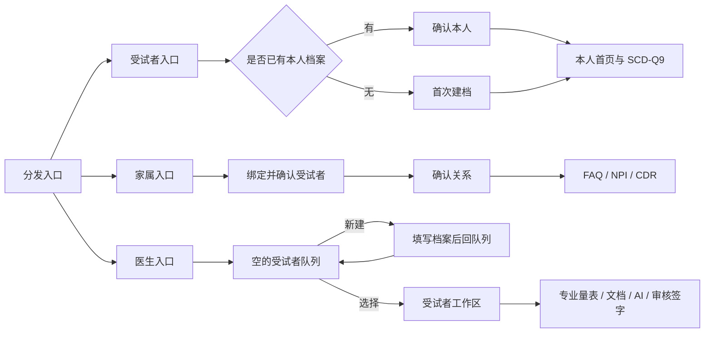

# P3 三端业务流程与产品实施基准

> 状态：当前唯一业务实施基准  
> 适用范围：`src/`、`server/`、`server.ts` 及我们维护的接口和数据文档  
> 原则：先按本文档确定流程，再逐项修改和验收代码

## 1. 产品定义

系统由三个独立使用端和一个分发入口组成：

| 使用端 | 实际使用者 | 核心任务 | 是否能切换到其他端 |
|---|---|---|---|
| 受试者端 | 当前受试者本人 | 本人建档或确认档案、完成 SCD-Q9、自查进度、查看医生已确认的本人摘要 | 不能 |
| 家属端 | 某一受试者的知情家属/照护者 | 绑定受试者、确认关系、完成 FAQ/NPI/CDR 观察项、查看授权状态 | 不能 |
| 医生端 | 医生/研究人员/建档人员 | 管理队列、创建并选择受试者、完成专业量表、处理文档、AI 研判、审核签字、导出 | 不能 |

三端不是一个页面里的三种视角。前端页面、导航和工作流程彼此独立；后端通过 `patient_id` 关联同一受试者的数据。

## 2. 入口和身份确认

### 2.1 分发入口

公共入口只显示三个明确入口：

- 受试者填写
- 家属填写
- 医生工作台

公共入口不显示某位受试者姓名、量表分数、当前诊断、AI 状态或技术说明，也不把任何历史受试者设为当前用户。

正式部署可使用三个独立地址。当前演示版可保留同一分发页，但进入后必须是三个独立顶级页面，不提供跨端切换。

### 2.2 受试者身份

受试者端在开始任何答题前必须取得唯一 `patient_id`：

1. 已通过专属链接、二维码或访问码绑定档案：读取档案，显示姓名和研究编号供本人确认。
2. 没有绑定但已有档案：当前演示版先在入口选择并确认受试者；正式版通过访问码或身份校验查找。
3. 尚无档案：受试者进入“首次建档”，完整填写基础信息后再进入本人首页。

已有档案时不得重复询问年龄等已保存字段。只有字段缺失或本人主动编辑时才补填。

### 2.3 家属身份

家属端在开始评估前必须绑定一位受试者：

1. 正式版通过受试者邀请链接、二维码或访问码绑定。
2. 当前演示版可在进入家属端前选择并二次确认受试者。
3. 进入后本次会话锁定该受试者，页面内不出现“切换家人档案”或全院受试者列表。
4. 家属先填写与受试者的关系，再开始观察评估。
5. 未找到档案时，由受试者本人首次建档，或由医生/工作人员创建；家属端不直接创建陌生受试者。

### 2.4 医生身份

医生端正式部署需要医生账号登录；课程演示可以免登录，但不能免除选择受试者这一步。

医生每次进入后的第一屏固定为受试者队列，且：

- `activePatientId` 初始值必须为 `null`。
- 不读取上次受试者并自动进入其档案。
- 不用队列第一人作为默认当前受试者。
- 未选择受试者时，不打开量表、报告、文档或 AI 页面。
- 选择某位受试者后，才建立医生本次工作上下文。
- 返回队列后清除当前工作上下文；“最近查看”只能作为列表提示，不能自动选中。

## 3. 新建受试者

只有两条合法路径：

### 3.1 受试者本人首次建档

受试者端无档案时进入建档流程，填写：姓名、性别、出生年、教育年限、身高、体重、婚姻、居住、电话。系统根据出生年计算年龄并生成研究编号。

完成后：

1. 创建新的 `patient_id`。
2. 保存完整基础档案。
3. 将当前受试者会话绑定到该档案。
4. 进入受试者本人首页，不自动生成任何量表答案或诊断。

### 3.2 医生代建档

医生在队列点击“新建受试者”，填写同一套必需字段并确认保存。完成后返回队列并高亮新记录，由医生明确点击后进入该受试者工作区。

新建档案禁止自动带入演示病例的姓名、年龄、量表答案、分数、病史或诊断。演示病例只能通过单独的“载入示例”动作生成，并清楚标识为示例数据。

字段结构、校验规则、研究编号及历史原型的 `window.INTAKE` 均按红线只读参考；现代系统在独立代码中实现等价能力，不修改原型。

## 4. 受试者端完整流程

受试者端第一页是“我的档案”，页面顶部只显示当前本人姓名和研究编号。

页面提供：

- 基础信息摘要；缺失时显示“补充信息”。
- SCD-Q9 当前状态：未开始、进行中、已完成或已跳过。
- “开始/继续自评”。
- 本人可见结果：完成提示、医生已审核的健康摘要、随访时间与一般建议。

SCD-Q9 流程：

1. 进入前再次确认当前姓名。
2. 按顺序完成 9 道主观题和 6 道情景题。
3. 当前题居中显示，回答按钮固定在页面下方。
4. 每次作答立即保存受试者草稿。
5. 离开时保存当前位置；再次进入从原题继续。
6. 选择“跳过自评”时保存 `skipped`，分数保持 `null`，不得记为 0。
7. 完成后提交量表并显示受试者可理解的完成提示。

受试者端不得显示医生专业量表、家属量表、医生队列、AI 待审核、电子签字和内部风险分层。医生已经签字确认的摘要可以按授权展示。

## 5. 家属端完整流程

家属端第一页是“知情者评估”，明确显示“正在为：姓名（研究编号）填写”和知情者关系。

页面提供：

- 受试者本人自评状态，只显示未开始/进行中/已完成/已跳过。
- FAQ 日常生活能力评估。
- NPI 精神行为观察。
- CDR 家属观察部分。
- 医生已审核且允许家属查看的随访安排或摘要。

答题流程：

1. 未确认关系时先确认关系。
2. 默认按单题逐步填写；可查看本量表答题进度。
3. 每选一题立即保存家属草稿。
4. 返回后必须恢复已保存答案和当前题。
5. 未作答显示“未作答”，不得显示为 0 分。
6. 只有家属明确选择了 0 对应选项，才记录数值 0。
7. 必答项未完成时不能把量表标记为已完成。
8. 提交后进入医生可查看状态，家属不能自行形成最终诊断。

家属端不得显示医生专业量表、AI 研判按钮、医生签名、全队列、研究导出和受试者切换控件。

## 6. 医生端完整流程

### 6.1 第一屏：受试者队列

队列只负责：

- 按姓名、研究编号或电话搜索。
- 查看受试者基本状态和各端完成进度。
- 新建受试者。
- 明确选择一位受试者。
- 进入待审核 AI 消息列表。

队列页没有默认受试者标题，也不提前显示某人的量表详情。

### 6.2 受试者工作区

医生选择受试者后进入工作区，固定显示“当前受试者：姓名（研究编号）”和“返回队列”。工作区包括：

- 档案和病史。
- 受试者自评与家属观察完成情况。
- 医生专业量表。
- 文档上传与结构化核对。
- 综合报告。
- AI 辅助研判。
- 医生审核与签字。
- 单人导出。

所有专业操作都必须绑定当前 `patient_id`。删除、覆盖档案、确认结构化文档和签署诊断等高影响操作需要二次确认。

### 6.3 专业量表归属

| 量表/模块 | 主要填写者 | 医生职责 |
|---|---|---|
| SCD-Q9 9题+6情景题 | 受试者 | 查看完成状态和结果 |
| HAMD-17 | 医生/主试 | 结构化提问并评分 |
| HAMA-14 | 医生/主试 | 结构化提问并评分 |
| MMSE | 医生/主试 | 施测并评分 |
| MoCA-B | 医生/主试 | 施测并评分 |
| AVLT-H | 医生/主试 | 控制词表、计时和评分 |
| VFT | 医生/主试 | 计时并记录结果 |
| FAQ-10 | 家属/知情者 | 查看并核对 |
| NPI-12 | 家属/知情者 | 查看并核对 |
| CDR | 家属提供观察，医生综合评级 | 确认 Global CDR/CDR-SB |

ADAS-Cog、BNT、STT、MES、Ecog、PSQI、RBDSQ、ESS、生物标志物等属于我们的医生端扩展模块；它们不能侵入受试者或家属自助流程。

## 7. 状态和计分规则

所有量表和题目统一使用明确状态：

| 状态 | 含义 | 是否有分数 |
|---|---|---|
| `not_started` | 尚未开始 | 否 |
| `in_progress` | 已有至少一题作答但未完成 | 否 |
| `completed` | 满足完成条件并完成计分 | 是 |
| `skipped` | 明确跳过整个允许跳过的模块 | 否，必须为 `null` |

题目级规则：

- 未作答：值为 `null` 或字段不存在，界面显示“未作答”。
- 已作答为 0：必须由使用者明确选择对应选项，界面可显示 0。
- 不适用：单独保存 `not_applicable`，是否参与计分由量表规则决定。
- 跳过模块：保存 `status: skipped`、`score: null` 和跳过原因。
- 只有 `completed` 状态才能生成总分和分级。

任何默认对象、演示数据或计算函数都不得用 `|| 0` 把缺失值转成已作答 0 分。

## 8. 数据保存和跨端共享

所有业务数据都必须存储，且每条业务写入必须能追溯到 `patient_id`、来源角色和更新时间。

| 数据 | 归属 | 保存时机 |
|---|---|---|
| 基础档案 | `patients` | 新建、补填、医生确认文档回填时 |
| 未完成答题 | `drafts(patient_id, role, flow_id)` | 每题、离开页面、网络恢复时 |
| 已提交量表 | `assessments` | 创建会话、提交答案、完成或跳过时 |
| 文档与解析 JSON | `documents` 或患者档案关联记录 | 上传、解析完成、医生确认时分别记录状态 |
| AI 研判 | `ai_consultations` | 请求完成后保存为待审核 |
| 医生审核签字 | AI 审核记录和患者最终诊断 | 医生确认签字时 |
| 消息提示 | `notifications` 或可追溯待办记录 | AI 结果进入待审核时 |

本地存储用于断网草稿和恢复，不是最终数据源。联网后同步 Turso；同步失败不得丢弃本地数据，也不能假装已经保存成功。

三端共享的是同一个受试者的数据，不共享页面状态：

- 受试者草稿只由 `patient` 角色恢复。
- 家属草稿只由 `informant` 角色恢复。
- 医生草稿只由 `examiner` 角色恢复。
- 任何端都不能继承另一个端的当前题号、未提交答案或页面位置。

## 9. 文档上传与结构化解析

该功能只属于医生端，并且必须先选择受试者。

正常流程：

1. 医生点击“上传文档”。
2. 选择图片/PDF/文本并点击“开始解析”。
3. 后端执行真实文档识别，并将原始结果交给结构化接口。
4. 结构化接口返回规范 JSON。
5. 页面并列显示来源内容和待写入字段。
6. 医生逐项核对、修改并确认。
7. 只有点击“确认写入档案”后才更新受试者数据。

演示流程：

- 弹窗右下角提供“模拟文档”。
- 点击后载入一份示例文件，并走同一套“解析结果-结构化 JSON-医生核对-确认写入”页面。
- 页面不显示模型名、Token、任务地址、“假装运行”等技术或演示说明。

真实接口必须保留；模拟文档只是演示入口，不能替代真实上传。

## 10. AI 研判、绘图和医生签字

AI 研判只属于医生端，并且必须绑定已选择受试者。

1. 医生在受试者工作区打开“AI 辅助研判”。
2. 正常操作调用真实后端接口。
3. 页面另提供“模拟回复”，用于立即生成一份结构相同的示例结果。
4. 无论真实或模拟，结果都保存为 `pending_review`。
5. 医生收到待审核提示，核对分型、依据和建议。
6. 医生可修改内容并签字确认，状态变为 `approved`。
7. 只有 `approved` 内容才能写入最终诊断，并按授权展示给受试者或家属。

绘图、临摹、钟表、图像识别等工具遵循同样规则：真实分析入口保留，另有“模拟回复”；分析结果显示在当前任务下，由医生确认后计入量表，不能直接形成最终诊断。

## 11. 三端可见范围

| 内容 | 受试者端 | 家属端 | 医生端 |
|---|---|---|---|
| 当前受试者基础摘要 | 本人 | 已绑定对象 | 已选择对象 |
| SCD-Q9 作答 | 填写 | 只看状态 | 查看 |
| FAQ/NPI/CDR 家属项 | 不显示 | 填写 | 查看/核对 |
| 医生专业量表 | 不显示 | 不显示 | 填写/查看 |
| 原始病历文档 | 不显示 | 不显示 | 上传/核对 |
| AI 待审核结果 | 不显示 | 不显示 | 查看/审核 |
| 已签字健康摘要 | 按授权查看 | 按授权查看 | 完整查看 |
| 全部受试者队列 | 不显示 | 不显示 | 查看 |
| 导出与删除 | 不显示 | 不显示 | 操作 |

## 12. 页面文案和交互约束

- 页面文字只说明当前要做的动作，不展示数据库、模型、缓存、角色隔离等实现说明。
- 不出现“患者视角”“知情者视角”“自动切换工作台”等内部表达。
- 受试者和家属页面不提供角色切换按钮。
- 回答按钮位于页面底部，适配 375px 宽度，不遮挡题目和进度。
- 未选择受试者时使用“请选择受试者”，不能显示示例姓名。
- 未作答使用“未作答”，不能显示 0 分或正常结论。
- 技术名称只出现在我们的技术文档和服务端日志，不出现在业务页面。

## 13. 历史原型代码保护与物理隔离红线

以下原始文件保持只读：

- `ad-ouc-prototype/app.js`
- `ad-ouc-prototype/scales.js`
- `ad-ouc-prototype/styles.css`

不得修改 `window.INTAKE`、SCD-Q9 跳过逻辑、`bigBtn()`、IIFE 内的 `state.view`、`state.flow`、`state.idx` 等状态。所有新功能只在我们的 `src/`、`server/` 和独立文档中实现。

## 14. 必须通过的验收场景

### 受试者

1. 已有档案的受试者进入后先确认本人，直接看到本人首页，不重复建档。
2. 无档案的受试者能填写完整信息并创建档案。
3. 中途退出 SCD-Q9 后能继续，其他人的答案不会出现。
4. 跳过后显示“已跳过”，数据库分数为 `null`。

### 家属

1. 进入前必须选择或绑定受试者，进入后不能切换到其他人。
2. 新量表全部显示“未作答”，不显示 0 分。
3. 逐题保存后刷新，答案和进度准确恢复。
4. 能看到受试者自评状态，但看不到医生专业量表和 AI 待审核内容。

### 医生

1. 进入医生端首先看到队列，页面没有默认受试者。
2. 不选择受试者时无法进入量表、文档、报告和 AI。
3. 新建受试者必须填写信息，不自动生成男/55 岁/示例编号或量表答案。
4. 选择受试者后所有操作只写入该 `patient_id`。
5. 返回队列后当前受试者被清除。
6. 文档真实上传和模拟文档都必须经过医生核对才写入。
7. AI 真实回复和模拟回复都先进入待审核，签字后才成为最终意见。

### 数据

1. 档案、三角色草稿、量表、文档结果、AI 结果和签字结果均能在后端恢复。
2. 换浏览器或清除本地缓存后，已同步数据仍能从 Turso 恢复。
3. 断网作答后恢复联网可同步，不能丢题或串人。
4. 每条记录均可确认受试者、来源角色、状态和更新时间。

## 15. 当前结论

本文已经明确“谁进入、先确认谁、能做什么、保存到哪里、谁可以看到、何时算完成”。后续代码修改必须按 `01_当前实现差距与后续修改顺序.md` 逐项进行，不再根据旧页面或历史交付文档临时决定流程。
