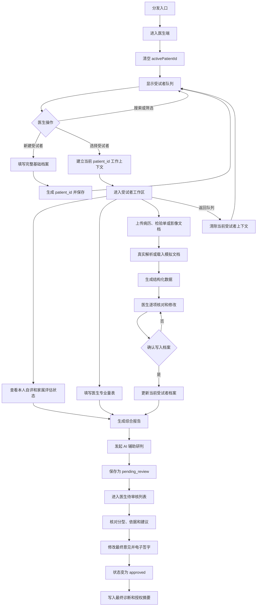

# 医生端流程图

```mermaid
flowchart TD
    A[分发入口] --> B[进入医生端]
    B --> C[清空 activePatientId]
    C --> D[显示受试者队列]

    D --> E{医生操作}
    E -->|搜索或筛选| D
    E -->|新建受试者| F[填写完整基础档案]
    F --> G[生成 patient_id 并保存]
    G --> D

    E -->|选择受试者| H[建立当前 patient_id 工作上下文]
    H --> I[进入受试者工作区]

    I --> J[查看本人自评和家属评估状态]
    I --> K[填写医生专业量表]
    I --> L[上传病历、检验单或影像文档]

    L --> M[真实解析或载入模拟文档]
    M --> N[生成结构化数据]
    N --> O[医生逐项核对和修改]
    O --> P{确认写入档案}
    P -->|否| O
    P -->|是| Q[更新当前受试者档案]

    K --> R[生成综合报告]
    J --> R
    Q --> R

    R --> S[发起 AI 辅助研判]
    S --> T[保存为 pending_review]
    T --> U[进入医生待审核列表]
    U --> V[核对分型、依据和建议]
    V --> W[修改最终意见并电子签字]
    W --> X[状态变为 approved]
    X --> Y[写入最终诊断和授权摘要]

    I -->|返回队列| Z[清除当前受试者上下文]
    Z --> D
```
